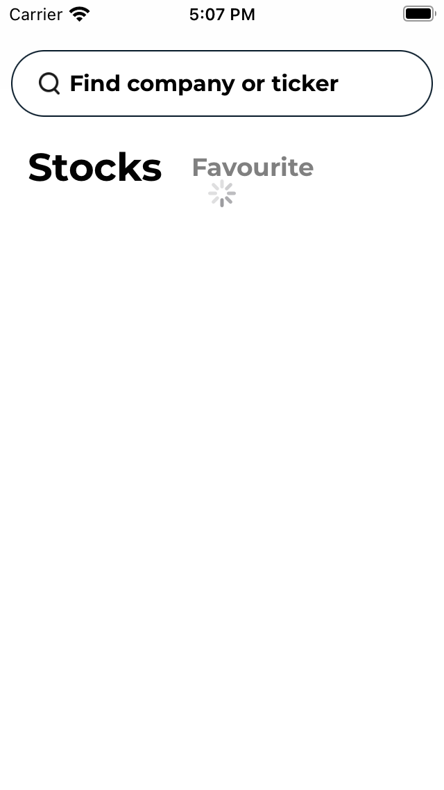
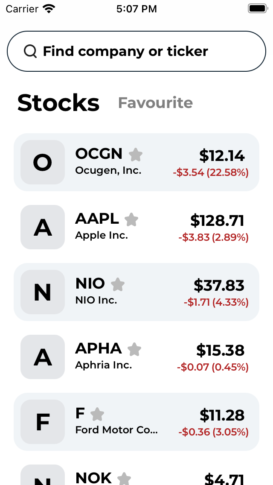
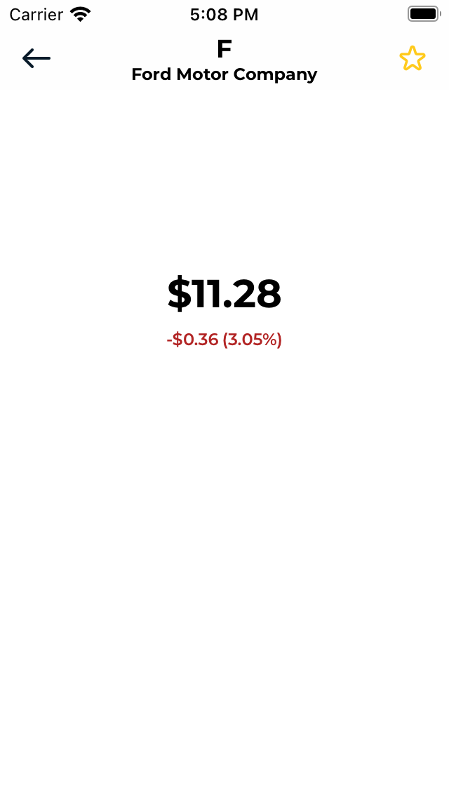
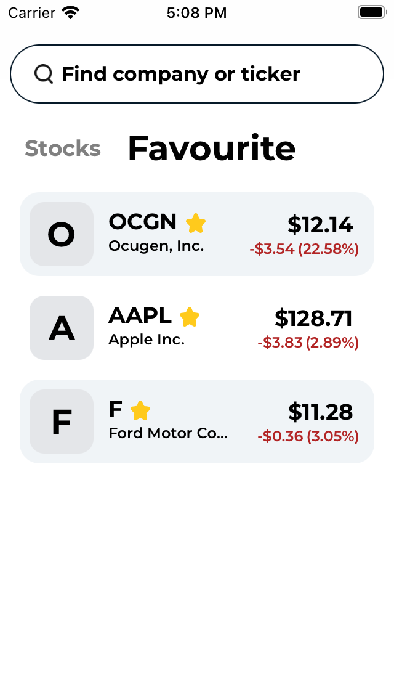
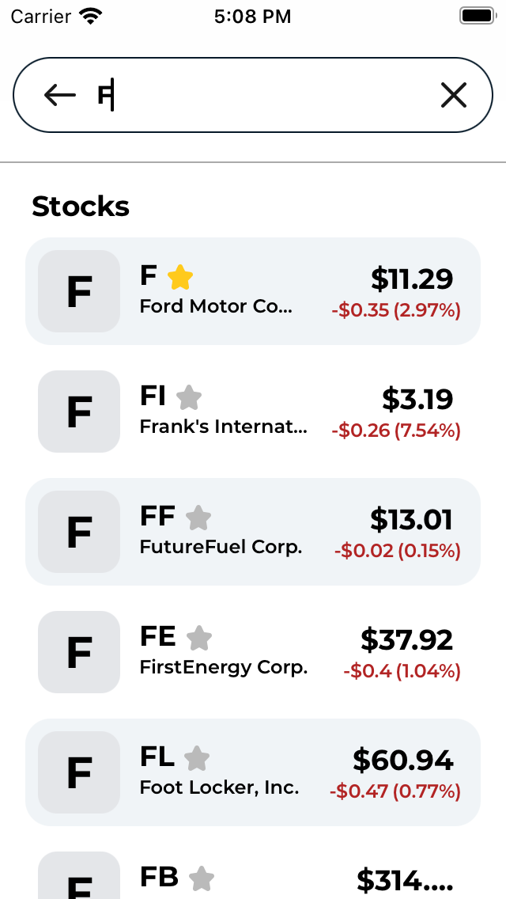
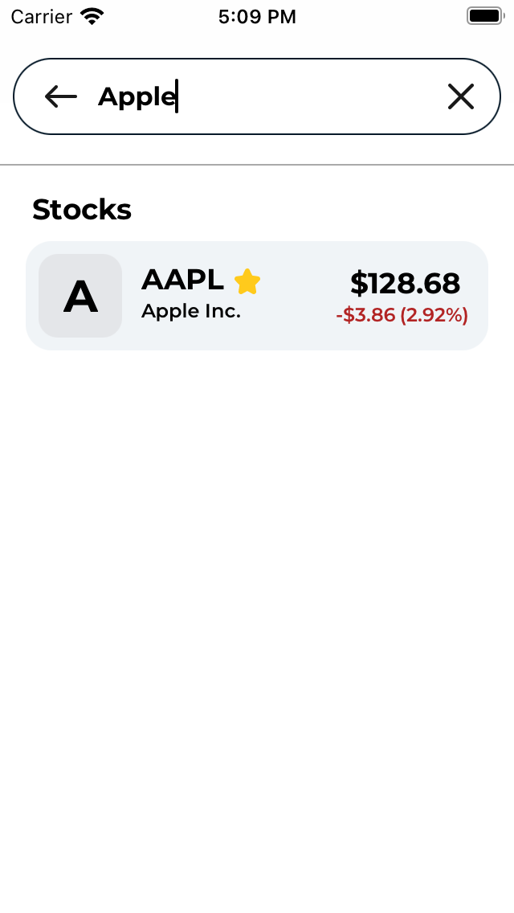

# StockMonitoring

Мобильное приложение для мониторинга цен акций на бирже

## **Функционал программы**
• На стартовом экране отображается список акций. У каждой акции указан тикер, название компании, текущая цена и изменение цены за сутки.

• Пользователь может добавлять акции в избранные и отдельно просматривать этот список.

• Пользователь может искать акции по тикеру или названию и добавлять их в избранные.

## **Скриншоты**
  

## **Стек**
UIKit, URLSession, CoreData,  CleanSwift

## **Ссылки на API**

[Finhub](https://finnhub.io/docs/api)

[MBOUM](https://mboum.com/api/documentation)
